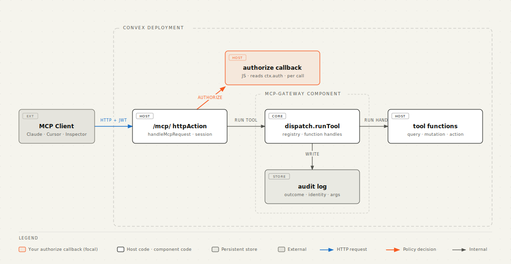

# convex-mcp-gateway

Auth-aware MCP server for [Convex](https://convex.dev). Expose selected
Convex functions as MCP tools, bring your own JWT issuer, declare
scopes/roles per tool, get an audit log and OAuth 2.1 protected-resource
discovery for free.

Built as a [Convex Component](https://www.convex.dev/components).

[](https://www.convex.dev/components/convex-mcp-gateway)
[](https://github.com/tfohlmeister/convex-mcp-gateway/actions/workflows/test.yml)
[](https://www.npmjs.com/package/convex-mcp-gateway)
[](./LICENSE)

<!-- START: Include on https://convex.dev/components -->

## Features

- **Type-safe tool registration** — `defineMcpQuery` / `defineMcpMutation` /
  `defineMcpAction` declare a Convex function as an MCP tool with end-to-
  end-typed `args` and (optional) `returns` validators
- **MCP 2025-06-18 Streamable HTTP** — sessions, `Accept` negotiation,
  `MCP-Protocol-Version` validation, identity-bound `DELETE`, single-
  frame SSE
- **One authorize callback** — gates `tools/call` and filters `tools/list`
  with `mode: "list" | "call"`; uses your existing `ctx.auth.getUserIdentity()`
- **OAuth 2.1 protected-resource discovery** — RFC 9728 metadata,
  RFC 6750 `WWW-Authenticate` headers, multi-tenant ready
- **Optional OAuth bridge** — RFC 8414 AS metadata wrap + RFC 7591 DCR
  for browser MCP clients (claude.ai) against IdPs without DCR support
- **Audit log** — one row per call with per-tool argument redaction
  (verbatim / dropped / dotted-path redacted)
- **Wire-error sanitization** — generic message on the wire, full detail
  in audit; `ConvexError` passes through for deliberate user-facing
  messages
- **`convex-test` helper** — `convex-mcp-gateway/test` exports a one-line
  `register(t)` that hooks the component into a `convexTest` instance so
  your host tests can exercise the full `/mcp/` round-trip in-process.
  See [Testing](./docs/testing.md)

## What it does



You mount the gateway in a single `httpAction` and pass an `authorize`
JS callback that decides per call whether the request goes through.
The gateway handles the JSON-RPC envelope, the Streamable-HTTP session
lifecycle, the OAuth discovery doc, the `WWW-Authenticate` headers, and
the audit log. Your existing Convex auth (Clerk, Auth0, Pocket-ID,
custom JWT issuer) just works.

A standalone editorial-styled version of the diagram is at
[`docs/diagrams/architecture.html`](./docs/diagrams/architecture.html);
in-depth sequence and data-flow diagrams live in
[`docs/architecture.md`](./docs/architecture.md).

## Try it

The companion repo
[**convex-mcp-gateway-demo**](https://github.com/tfohlmeister/convex-mcp-gateway-demo)
is a notes app that registers five tools (public, identity-gated,
role-gated) and shows the audit log live. Three run modes including
a local-backend setup that needs no Convex account:

```sh
git clone https://github.com/tfohlmeister/convex-mcp-gateway-demo
cd convex-mcp-gateway-demo
pnpm install && pnpm local:start    # in one terminal
pnpm convex:dev && pnpm convex:run mcp:registerDefaults && pnpm dev
```

## Quickstart

```sh
pnpm add convex-mcp-gateway
```

```ts
// convex/convex.config.ts
import { defineApp } from "convex/server";
import mcpGateway from "convex-mcp-gateway/convex.config";

const app = defineApp();
app.use(mcpGateway);
export default app;
```

```ts
// convex/mcp.ts — register tools
import { v } from "convex/values";
import { McpGateway, defineMcpQuery } from "convex-mcp-gateway";
import { api, components } from "./_generated/api.js";
import { internalMutation } from "./_generated/server.js";

const gateway = new McpGateway(components.mcpGateway);

export const registerDefaults = internalMutation({
  args: {},
  handler: async (ctx) => {
    await gateway.register(
      ctx,
      [
        defineMcpQuery({
          name: "invoices_summary",
          description: "Public invoice counter.",
          fn: api.invoices.summary,
          args: {},
          metadata: { public: true },
        }),
        defineMcpQuery({
          name: "invoices_list",
          description: "List invoices for the authenticated user.",
          fn: api.invoices.list,
          args: { status: v.optional(v.string()) },
        }),
      ],
    );
  },
});
```

```ts
// convex/http.ts — mount the gateway with your authorize callback
import { httpRouter } from "convex/server";
import {
  McpGateway,
  type McpAuthorizerHandler,
} from "convex-mcp-gateway";
import { components } from "./_generated/api.js";
import { httpAction } from "./_generated/server.js";

const gateway = new McpGateway(components.mcpGateway);

const authorize: McpAuthorizerHandler = async (ctx, { toolMetadata }) => {
  const meta = (toolMetadata ?? {}) as { public?: boolean };
  if (meta.public) return { allowed: true };
  const identity = await ctx.auth.getUserIdentity();
  if (!identity) return { allowed: false, reason: "Unauthorized" };
  return { allowed: true };
};

const http = httpRouter();
const mcp = httpAction(async (ctx, req) =>
  gateway.handleMcpRequest(ctx, req, { authorize }),
);
// Mount both /mcp/ and /mcp — some clients (claude.ai) strip the
// trailing slash from the configured URL before POSTing.
for (const path of ["/mcp/", "/mcp"]) {
  http.route({ path, method: "POST", handler: mcp });
  http.route({ path, method: "GET", handler: mcp });
  http.route({ path, method: "DELETE", handler: mcp });
}
export default http;
```

```sh
npx convex dev --once
npx convex run mcp:registerDefaults

# Talk to it (Streamable HTTP — initialize first, then send commands).
SESSION=$(curl -sSD - -X POST "$CONVEX_SITE_URL/mcp/" \
  -H 'content-type: application/json' \
  -H 'accept: application/json, text/event-stream' \
  -d '{"jsonrpc":"2.0","id":1,"method":"initialize","params":{"protocolVersion":"2025-06-18"}}' \
  | awk '/^[Mm]cp-[Ss]ession-[Ii]d:/ {print $2}' | tr -d '\r')

curl -X POST "$CONVEX_SITE_URL/mcp/" \
  -H 'content-type: application/json' \
  -H 'accept: application/json, text/event-stream' \
  -H "mcp-session-id: $SESSION" \
  -d '{"jsonrpc":"2.0","id":2,"method":"tools/list"}'
```

The anonymous client sees only `invoices_summary` (the `public: true`
tool); calling `invoices_list` without a Bearer returns HTTP 401 with a
`WWW-Authenticate` header pointing at your discovery endpoint. Any
spec-compliant MCP client (the official MCP Inspector, IDE plugins,
agent runtimes) handles the session and OAuth handshakes
automatically. See [Getting Started](./docs/getting-started.md) for
the full walkthrough.

## Documentation

- **[Getting Started](./docs/getting-started.md)** — install, register,
  call, in five minutes
- **[Architecture](./docs/architecture.md)** — component model, data
  flow, sequence diagrams
- **[Authorization](./docs/authorization.md)** — authorizer contract,
  `mode: "list"` vs `"call"`, scope/role recipes
- **[OAuth 2.1 setup](./docs/oauth.md)** — RFC 9728 discovery, host-side
  mount, multi-tenant
- **[OAuth bridge mode](./docs/oauth-bridge.md)** — opt-in DCR + AS
  metadata wrap + userinfo token validation, for browser MCP clients
  (claude.ai) against IdPs that don't support Dynamic Client
  Registration (Pocket-ID, etc.)
- **[Audit log](./docs/audit-log.md)** — reading, filtering, redacting,
  pruning
- **[Testing](./docs/testing.md)** — convex-test patterns, identity
  injection, swappable authorizers

## Design choices, briefly

- **One authorizer query, deny-by-default.** The component has no
  notion of scopes, roles, JWT claims, or tenants. It calls one
  `internalQuery` per dispatch and lets it decide. Until that query is
  registered, nothing works.
- **Scope-aware `tools/list`.** The catalog visible to a caller equals
  the set of tools they could actually invoke; the same authorizer
  filters both with a `mode: "list"` discriminator.
- **Audit never alters dispatch.** Every audit write is best-effort;
  failures log and swallow. A successful tool mutation always returns
  `ok: true`.
- **Identity propagation is free.** Convex validates inbound Bearer
  tokens against your `auth.config.ts` before any function runs; the
  same identity flows into the authorizer and the tool handler.
- **OAuth discovery is opt-in.** Configure an authorization server, and
  401s carry `WWW-Authenticate` headers per RFC 6750 and the
  RFC 9728 path-prefix metadata URL.

<!-- END: Include on https://convex.dev/components -->

## Local development

```sh
pnpm install
pnpm check                              # codegen + typecheck + tests + lint

# Iterate against a local Convex backend:
pnpm local:start                        # downloads the pinned binary, writes .env.local
                                        # runs on :3310 / :3311 (no Docker)
```

The local backend uses upstream test fixture credentials checked into
`get-convex/convex-backend` — public, deterministic, safe to commit.
See [docs/testing.md](./docs/testing.md) for `convex-test` patterns and
[CONTRIBUTING.md](./CONTRIBUTING.md) for the contribution workflow.

## Roadmap

**Auth model: bring your own IdP.** Any OAuth 2.1 / OIDC issuer that
Convex's `auth.config.ts` can validate against (Pocket-ID, Auth0,
Clerk, Keycloak, AWS Cognito, Authentik, custom JWT issuer) plugs in
without code changes. We deliberately do **not** ship a bundled
authorization server: building DCR + PKCE + token issuance + key
rotation duplicates what every IdP already does, and an MCP gateway
that's also an IdP would be two security-critical surfaces in one
component. The gateway only implements the resource-server side of
MCP's OAuth profile (RFC 9728 discovery, RFC 6750 `WWW-Authenticate`).
A separate bridge mode (RFC 8414 metadata + RFC 7591 DCR wrap) lets
hosts whose upstream IdP doesn't speak DCR still serve browser MCP
clients — see [docs/oauth-bridge.md](./docs/oauth-bridge.md).

### Future

- Capability tokens for agent-spawning workflows (small JWT helper,
  not a full AS: `gateway.signCapabilityToken({ tools, runId, ttl })`
  plus authorizer-side validation)
- `mcpResource` and `mcpPrompt` MCP primitives
- Multi-tenant pre-baked patterns (per-tenant URL, RFC 8707 audience
  binding)
- Audit-log UI
- Reverse direction (consume external MCP servers as Convex tools)
- Smithery.ai listing
- RFC 8693 token exchange for cross-domain identity

See the repo's GitHub issues for finer-grained tracking.

## Security

If you discover a vulnerability, please follow [SECURITY.md](./SECURITY.md)
(do not file a public issue).

## License

[Apache-2.0](./LICENSE)
