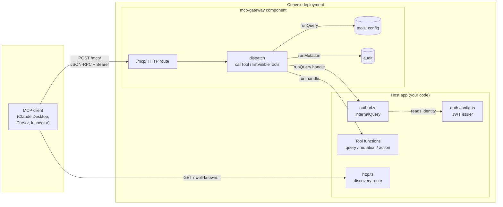
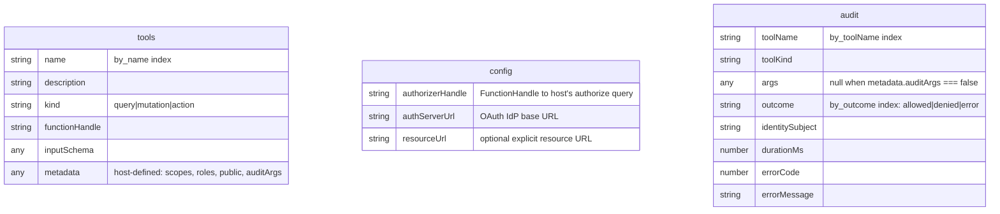
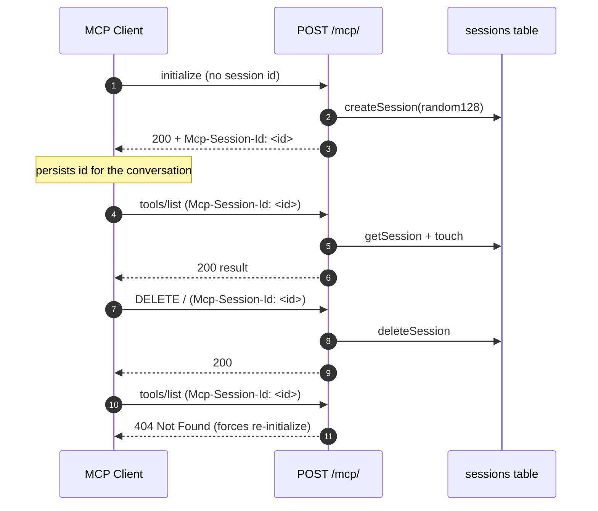
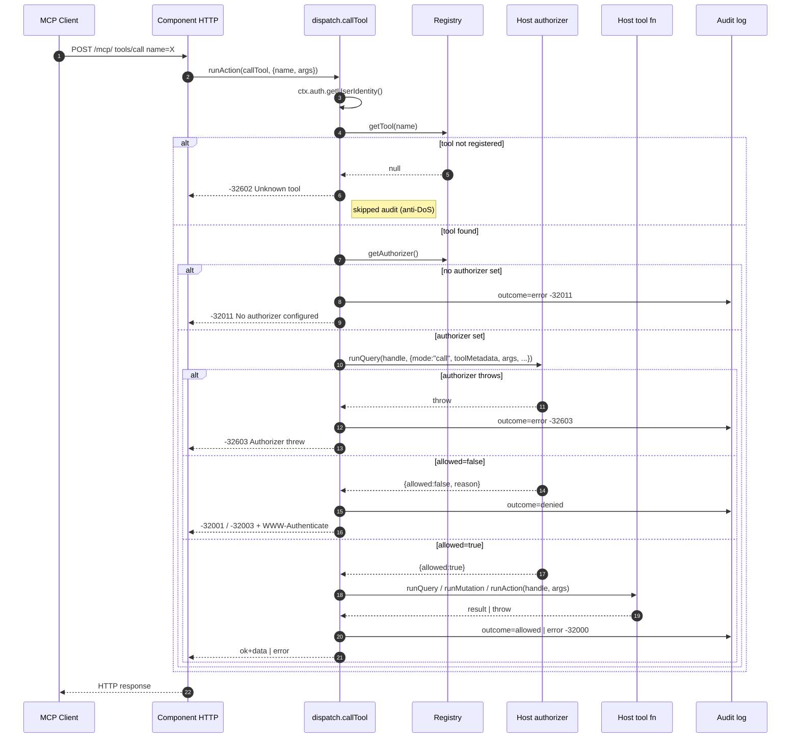
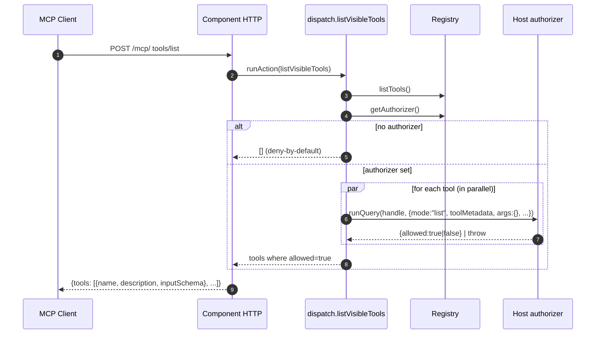

# Architecture

The gateway is a Convex component that sits between an MCP client and
your existing Convex functions. It owns its own HTTP route, its own
storage tables (registry, config, audit), and one piece of public
contract: the authorizer query you write.

## High-level

The split is deliberate:

- **Component**: protocol surface (JSON-RPC, MCP versions, OAuth header
  semantics), registry of `(name → function handle)` mappings, and the
  audit pipeline. It has zero opinions about scopes, roles, or which
  tools are public.
- **Host**: the authorizer (one query that decides per call), the actual
  business-logic functions registered as tools, and the OAuth discovery
  route mounted at the RFC 9728 canonical path.

The component cannot reach the host's tables directly; everything goes
through `createFunctionHandle` references the host registers via
`gateway.register`. Conversely, the host never imports component
internals; it only sees `components.mcpGateway.<module>.<function>` plus
the `McpGateway` client class.

## Data model

Three tables, all owned by the component:

- `tools` is a per-tool row keyed by `name`. `functionHandle` is the
  opaque reference returned by `createFunctionHandle(fn)` and dispatched
  with `ctx.runQuery / runMutation / runAction`.
- `config` is a singleton row holding the authorizer handle and the
  OAuth metadata.
- `audit` grows linearly with `tools/call` traffic. Two indexes
  (`by_toolName`, `by_outcome`) keep the most common queries cheap.
- `sessions` is the MCP Streamable HTTP session table. One row per
  active client, keyed on the cryptographically random session id the
  server issued during `initialize`. The row also stores the
  negotiated protocol version and a `lastSeenAt` timestamp for
  idle-pruning via `gateway.pruneSessions` if the host wants it.

## MCP Streamable HTTP transport

The component implements MCP 2025-06-18 Streamable HTTP at the
`/mcp/` endpoint:

| Method | Purpose | Notes |
|---|---|---|
| `POST /mcp/` | Send a JSON-RPC message | First call must be `initialize`; subsequent calls require `Mcp-Session-Id` |
| `GET /mcp/` | Open server-initiated SSE channel | Returns `405 Method Not Allowed`; we don't push notifications yet |
| `DELETE /mcp/` | Terminate session | Drops the session row; subsequent requests with that id get `404` |

Two response shapes for `POST` are both supported. The server picks
based on the client's `Accept` header:

- `Accept: application/json` → JSON envelope (default, simplest)
- `Accept: text/event-stream` → single-frame SSE response with the same
  payload wrapped in an event. Used by clients that prefer streaming
  transport even for short responses; ready for future progress
  notifications without protocol change.

Sessions are required after `initialize` (HTTP `400` on missing
header). The server may also terminate a session at any time; clients
that get `404` on a previously valid session id MUST start a fresh
`initialize`. The component never garbage-collects sessions on its own;
the host can schedule `gateway.pruneSessions(ctx, idleMs)` from a
cron if needed.

## Request flow: `tools/call`

A few invariants worth pointing out, because they were edge cases the
review caught:

- **Audit never alters the dispatch outcome.** Every audit write goes
  through `safeRecordAudit`, which logs and swallows its own failures.
  A successful tool mutation always returns `ok: true`, even if the
  audit row could not be inserted.
- **Audit is written *after* the tool handler returns**, outside the
  handler's try/catch, so a failing audit insert can never invert a
  committed mutation into a `-32000` error response.
- **Unknown-tool calls are not audited.** Anonymous callers can spam
  arbitrary names with arbitrary args; auditing them would let a
  drive-by attacker grow your `audit` table without bound.
- **Authorizer throws are isolated.** They become `-32603` JSON-RPC
  errors with an audit entry, not HTTP 500s. The MCP client can recover.

## Request flow: `tools/list`

The catalog visible to a caller is exactly the set of tools the
authorizer would let them call. This means an unauthenticated client
sees only public tools, and an authenticated user without a particular
role never even sees the role-gated mutations in their tool list.

The authorizer is invoked once per registered tool, in parallel via
`Promise.all`. For 5 to 20 tools that is a non-issue; if your registry
grows large, you can move expensive checks into `metadata` (which the
authorizer receives without needing to re-read the registry).

## Identity propagation

Convex validates the inbound `Authorization: Bearer <jwt>` header
against your `auth.config.ts` before any function runs. The component's
`callTool` action calls `ctx.auth.getUserIdentity()` once at the top
and reuses the result; the same Convex auth context propagates through
`ctx.runQuery(authorizerHandle, ...)` and `ctx.runQuery / Mutation /
Action(toolHandle, ...)`, so:

- The authorizer can call `ctx.auth.getUserIdentity()` and see the
  caller, exactly as in any other Convex query.
- The tool handler sees the same identity via the same call.
- The audit row stores `identity.subject` (or `null` for anonymous).

There is no special MCP-vs-HTTP distinction. Whatever JWT issuer you
already use (Clerk, Auth0, Pocket-ID, custom) keeps working without
glue code.

## Why some component functions are `mutation` not `internalMutation`

If you read the source you will notice that `audit.recordEntry`,
`registry.*`, and `dispatch.*` are declared as `mutation` / `query` /
`action` rather than the `internal*` variants. This is intentional and
specific to Convex components.

Generated component API references (`api`, `internal` exported from
`_generated/api.ts`) are both backed by `anyApi` at runtime, which
strips the public/internal marker. A component that calls its own
`internalMutation` via `internal.audit.recordEntry` fails at runtime
with `Couldn't resolve api.audit.recordEntry`. Declaring the function as
public `mutation` fixes the resolution; the component boundary still
prevents external callers from invoking it (only the host can reach
`components.mcpGateway.audit.recordEntry`, and the host already trusts
itself).

## Failure modes summary

| Failure | What the gateway does |
|---|---|
| Tool not registered | `-32602 Unknown tool` (no audit row) |
| No authorizer configured | `-32011 No authorizer configured` (audit `error`) |
| Authorizer returns `allowed: false` | `-32001 Unauthorized` if reason starts `Unauth*`, else `-32003 Forbidden`. 401 also gets `WWW-Authenticate`. (audit `denied`) |
| Authorizer throws | `-32603 Authorizer threw: ...` (audit `error`) |
| Authorizer returns malformed shape | Treated as `allowed: false` with explanatory reason (audit `denied`) |
| Tool handler throws | `-32000` with the error message (audit `error`) |
| Audit-write fails | Logged via `console.error`, swallowed. Dispatch outcome unchanged. |

## Going deeper

- [authorization.md](./authorization.md) for the authorizer contract,
  modes, and metadata-driven scope/role recipes
- [oauth.md](./oauth.md) for the OAuth 2.1 protected-resource discovery
  flow
- [audit-log.md](./audit-log.md) for audit reading, redaction, and
  pruning
- [testing.md](./testing.md) for `convex-test` patterns specific to this
  component
