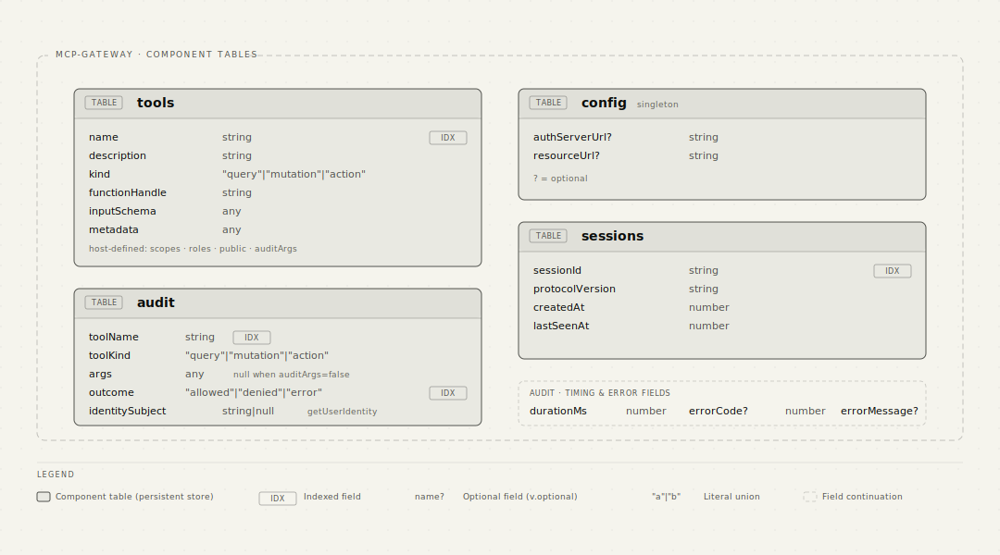
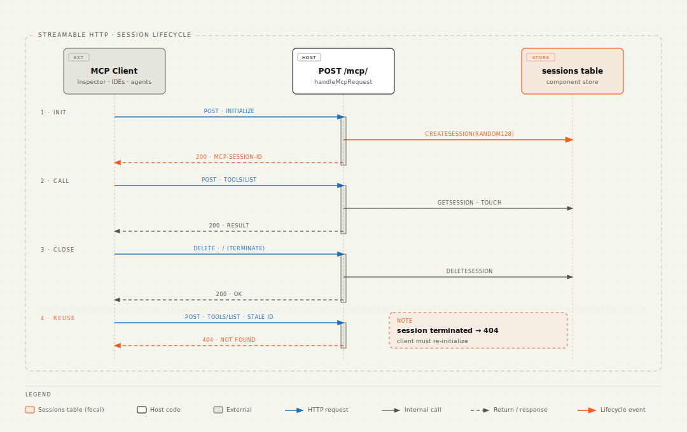
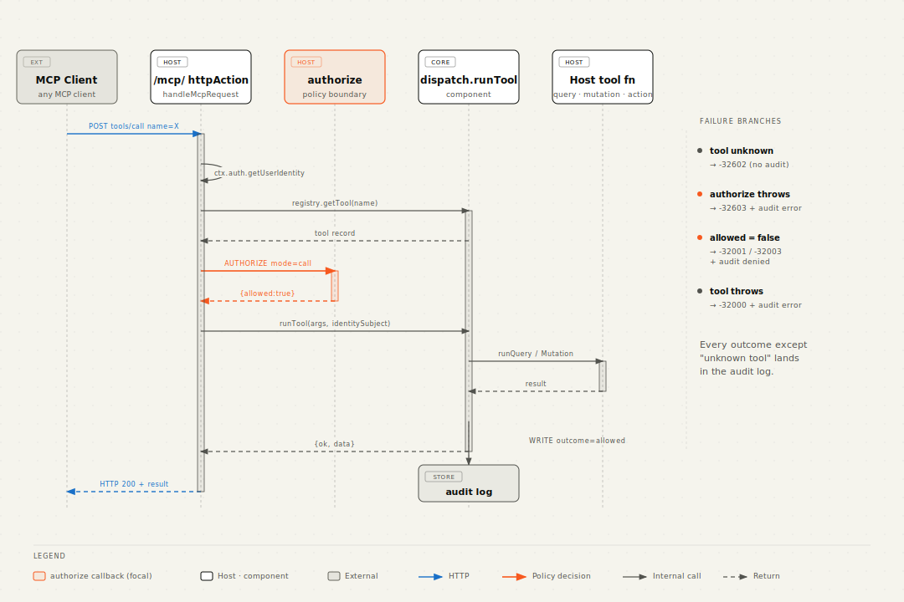
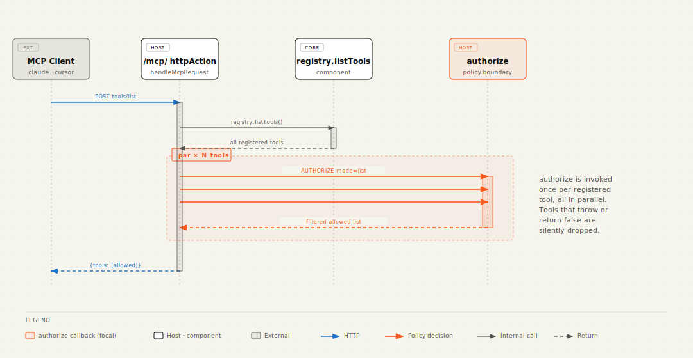
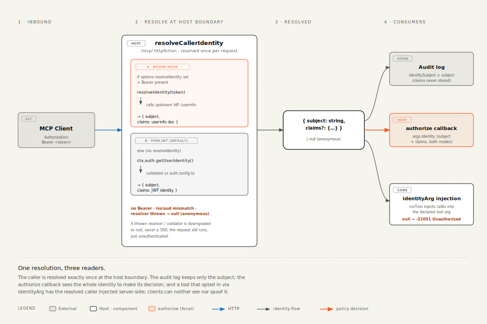

# Architecture

The gateway is a Convex component that owns four storage tables (registry,
config, audit, sessions) and a tiny dispatch action. The protocol surface
(`/mcp/`), the OAuth discovery route, and the policy decision (the
authorize callback) all live in the **host's** `httpAction` context, not
in the component.

## Why HTTP and authorize live in the host

Convex doesn't propagate `ctx.auth` into component code. The
JWT-validated identity (`ctx.auth.getUserIdentity()`) is only readable
from a host-mounted `httpAction`. Two consequences flow from this:

1. The gateway cannot mount `/mcp/` itself, because anything inside the
   `httpAction` would see `ctx.auth === undefined`. The host owns the
   route and calls `gateway.handleMcpRequest(ctx, request, { authorize })`.
2. The authorize callback runs in the host context (where identity is
   visible) before the component dispatches the tool. The component
   never sees identity directly; the host passes it down as an
   `auditIdentitySubject` string for the audit row.

That split is the entire architecture in one paragraph.

## High-level


The split:

- **Component**: storage (registry, config, audit, sessions) and a thin
  dispatch action that runs a tool by name and writes audit rows. It
  has zero opinions about scopes, roles, or which tools are public.
- **Host**: the `/mcp/` HTTP route, the authorize callback (one JS
  function that decides per call), the actual business-logic functions
  registered as tools, and the OAuth discovery route mounted at the
  RFC 9728 canonical path.
- **Client library code** (shipped inside the npm package, runs in the
  host): `handleMcpRequest` is the JSON-RPC envelope, session lifecycle,
  content negotiation, and the bridge between identity + authorize +
  component dispatch. It is part of the gateway from a developer's
  perspective but executes inside the host's `httpAction` so it can
  read `ctx.auth`.

The component cannot reach the host's tables directly; everything goes
through `createFunctionHandle` references the host registers via
`gateway.register`. The host never imports component internals; it only
sees `components.mcpGateway.<module>.<function>` plus the `McpGateway`
client class.

## Data model



Four tables, all owned by the component:

- `tools` is a per-tool row keyed by `name`. `functionHandle` is the
  opaque reference returned by `createFunctionHandle(fn)` and dispatched
  with `ctx.runQuery / runMutation / runAction`.
- `config` is a singleton row holding the OAuth metadata. Authorization
  itself is **not** stored here: it lives in the host as a regular JS
  callback passed to `gateway.handleMcpRequest`.
- `sessions` is the MCP Streamable HTTP session table. One row per
  active client, keyed on the cryptographically random session id the
  server issued during `initialize`. The row also stores the
  negotiated protocol version and a `lastSeenAt` timestamp for
  idle-pruning via `gateway.pruneSessions` if the host wants it.
- `audit` grows linearly with `tools/call` traffic. Two indexes
  (`by_toolName`, `by_outcome`) keep the most common queries cheap.

## MCP Streamable HTTP transport

The host-mounted `handleMcpRequest` implements MCP 2025-06-18 Streamable
HTTP at the `/mcp/` endpoint:

| Method | Purpose | Notes |
|---|---|---|
| `POST /mcp/` | Send a JSON-RPC message | First call must be `initialize`; subsequent calls require `Mcp-Session-Id` |
| `GET /mcp/` | Open server-initiated SSE channel | Returns `405 Method Not Allowed`; we don't push notifications yet |
| `DELETE /mcp/` | Terminate session | Drops the session row; subsequent requests with that id get `404` |

Two response shapes for `POST` are both supported. The server picks
based on the client's `Accept` header:

- `Accept: application/json` → JSON envelope (default, simplest)
- `Accept: text/event-stream` → single-frame SSE response with the same
  payload wrapped in an event. Used by clients that prefer streaming
  transport even for short responses; ready for future progress
  notifications without protocol change.



Sessions are required after `initialize` (HTTP `400` on missing
header). The server may also terminate a session at any time; clients
that get `404` on a previously valid session id MUST start a fresh
`initialize`. The component never garbage-collects sessions on its own;
the host can schedule `gateway.pruneSessions(ctx, idleMs)` from a
cron if needed.

## Request flow: `tools/call`



A few invariants worth pointing out:

- **Audit never alters the dispatch outcome.** Every audit write goes
  through `safeRecordAudit`, which logs and swallows its own failures.
  A successful tool mutation always returns `ok: true`, even if the
  audit row could not be inserted.
- **Audit is written *after* the tool handler returns**, outside the
  handler's try/catch, so a failing audit insert can never invert a
  committed mutation into a `-32000` error response.
- **Unknown-tool calls are not audited.** Anonymous callers can spam
  arbitrary names with arbitrary args; auditing them would let a
  drive-by attacker grow the `audit` table without bound.
- **Authorize throws are isolated.** They become `-32603` JSON-RPC
  errors with an audit entry, not HTTP 500s. The MCP client can recover.
- **Identity flows host-side only, by default.** The component receives
  `auditIdentitySubject: string | null` for audit purposes; the full
  identity object stays in the host. The one exception is a tool that
  opts in via `identityArg` (see [Identity propagation](#identity-propagation)):
  for those, the resolved caller `{ subject, claims }` is passed to
  `runTool` so the gateway can inject it into the named argument. It is
  never written to the audit log.

## Request flow: `tools/list`



The catalog visible to a caller is exactly the set of tools the
authorize callback would let them call. An unauthenticated client sees
only public tools, and an authenticated user without a particular role
never even sees the role-gated mutations in their tool list.

The callback is invoked once per registered tool, in parallel via
`Promise.all`. For 5 to 20 tools that is a non-issue; if your registry
grows large, move expensive checks into `metadata` (which the callback
receives without needing to re-read the registry).

## Identity propagation

Convex validates the inbound `Authorization: Bearer <jwt>` header
against your `auth.config.ts` before any function runs. Inside the
host's `/mcp/` `httpAction`:

- `handleMcpRequest` resolves the caller once at the boundary and reuses
  the result everywhere. Resolution order: `options.resolveIdentity(token)`
  if configured and a Bearer is present (the userinfo-bridge path), else
  Convex's `ctx.auth.getUserIdentity()` validated against your
  `auth.config.ts`. Either way the shape is
  `{ subject: string; claims?: Record<string, unknown> } | null`.
- The resolved `subject` becomes `auditIdentitySubject` for the audit
  row. The full identity is also handed to the authorize callback as
  `args.identity` (so the callback works in both bridge and pure-JWT
  modes).
- The audit row stores `identity.subject` (or `null` for anonymous).



### Injecting the caller into a tool (`identityArg`)

Tool handlers invoked via `dispatch.runTool` run inside the component,
where `ctx.auth` is **not** available, so a dispatched tool cannot read
the caller from the token. The supported channel is `identityArg`:

- Declare an argument with `mcpCallerValidator` (shape
  `{ subject: string; claims?: any }`) and name it in the tool's
  `identityArg`.
- At registration, the gateway removes that argument from the advertised
  `inputSchema`, so clients never see it.
- At request time, any client-supplied value for that argument is
  stripped (no spoofing), and the gateway injects the identity it
  resolved at the boundary right before dispatch.
- A tool that declares `identityArg` structurally needs a caller. If
  none was resolved, the call is denied as `-32001 Unauthorized` (both
  in the host handler and again inside `runTool`, so a direct component
  call can't inject `null` and trip the function's arg validator). The
  tool never runs unscoped.
- The injected argument is stripped before the audit write, so the
  caller and its claims never reach the audit log; the subject is still
  recorded in the audit row's dedicated `identitySubject` column.

```ts
// convex/invoices.ts
export const whoami = query({
  args: { caller: mcpCallerValidator },
  handler: async (_ctx, { caller }) => ({ subject: caller.subject }),
});

// convex/mcp.ts
defineMcpQuery({
  name: "invoices_whoami",
  fn: api.invoices.whoami,
  args: { caller: mcpCallerValidator },
  identityArg: "caller", // gateway fills `caller`; clients can't send it
}),
```

Whatever JWT issuer you already use (Clerk, Auth0, Pocket-ID, custom)
keeps working without glue code.

## Why some component functions are `mutation` not `internalMutation`

If you read the source you will notice that `audit.recordEntry`,
`registry.*`, and `dispatch.*` are declared as `mutation` / `query` /
`action` rather than the `internal*` variants. This is intentional and
specific to Convex components.

Generated component API references (`api`, `internal` exported from
`_generated/api.ts`) are both backed by `anyApi` at runtime, which
strips the public/internal marker. A component that calls its own
`internalMutation` via `internal.audit.recordEntry` fails at runtime
with `Couldn't resolve api.audit.recordEntry`. Declaring the function as
public `mutation` fixes the resolution; the component boundary still
prevents external callers from invoking it (only the host can reach
`components.mcpGateway.audit.recordEntry`, and the host already trusts
itself).

## Failure modes summary

| Failure | What the gateway does |
|---|---|
| Tool not registered | `-32602 Unknown tool` (no audit row) |
| Authorize returns `allowed: false` | `-32001 Unauthorized` if reason starts `Unauth*`, else `-32003 Forbidden`. 401 also gets `WWW-Authenticate`. (audit `denied`) |
| Authorize throws | `-32603 Authorizer threw: ...` (audit `error`) |
| Authorize returns malformed shape | Treated as `allowed: false` with explanatory reason (audit `denied`) |
| Tool handler throws | `-32000` with the error message (audit `error`) |
| Audit-write fails | Logged via `console.error`, swallowed. Dispatch outcome unchanged. |
| Session id missing on a non-`initialize` request | HTTP 400 |
| Session id unknown / terminated | HTTP 404 (forces fresh `initialize`) |
| Anonymous POST with `requireAuth: true` | HTTP 401 (+ `WWW-Authenticate` when OAuth is configured) before session handling, so browser clients begin OAuth. Opt-in; see [oauth.md](./oauth.md#all-private-servers-and-browser-clients-requireauth) |

## Going deeper

- [authorization.md](./authorization.md) for the authorize-callback
  contract, modes, and metadata-driven scope/role recipes
- [oauth.md](./oauth.md) for the OAuth 2.1 protected-resource discovery
  flow
- [audit-log.md](./audit-log.md) for audit reading, redaction, and
  pruning
- [testing.md](./testing.md) for `convex-test` patterns specific to this
  component
