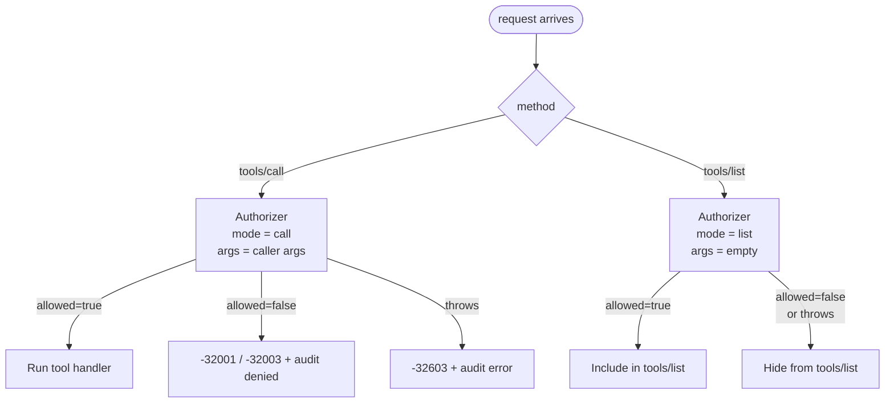

# Authorization

The gateway delegates every access decision to **one query you write**:
the *authorizer*. The component itself has no notion of public tools,
scopes, roles, or tenant boundaries. That keeps the component generic
and lets your auth model be whatever it already is.

## The contract

```ts
import {
  mcpAuthorizerArgs,
  mcpAuthorizerReturns,
  type McpAuthorizerHandler,
} from "@convex-dev/mcp-gateway";
import { internalQuery } from "./_generated/server.js";

export const authorize = internalQuery({
  args: mcpAuthorizerArgs,
  returns: mcpAuthorizerReturns,
  handler: (async (ctx, args) => {
    // ... your decision ...
    return { allowed: true };
  }) satisfies McpAuthorizerHandler,
});
```

`mcpAuthorizerArgs` exports the args validator the gateway will call
with. Your handler receives:

| Field | Type | Meaning |
|---|---|---|
| `toolName` | `string` | Registered tool name |
| `toolKind` | `"query" \| "mutation" \| "action"` | What kind of function it is |
| `args` | `any` | Caller-supplied arguments (`{}` in `mode: "list"`) |
| `mode` | `"call" \| "list"` | See below |
| `toolMetadata` | `unknown` | Whatever the host passed via `defineMcp*({ metadata })` |

Return either `{ allowed: true }` or `{ allowed: false, reason?: string }`.

If `reason` starts with `"Unauth"` (case-insensitive), the gateway maps
the JSON-RPC error to `-32001 Unauthorized` and adds a
`WWW-Authenticate` header on the HTTP response (so MCP clients can begin
the OAuth flow). Anything else maps to `-32003 Forbidden` without
discovery hints.

## Two modes: `call` and `list`



The contract: **the catalog visible to a caller equals the set of tools
they could actually invoke.** An unauthenticated client never sees the
admin mutation in their tool list. A finance team member never sees the
HR tool, even by name.

Most authorizers ignore `mode` because the same logic determines both
"can I see this" and "can I call this". Use `mode === "list"` only when
you want to expose a tool's existence even though calls might still be
gated on dynamic arguments. Example: a search tool that's listable to
everyone but only callable for authenticated users could check
`if (mode === "list") return { allowed: true }; ...`.

## Recipes

### Public + authenticated tools, identity-only

Simplest possible policy: tools opt in to public via metadata; everything
else needs a valid JWT.

```ts
import {
  mcpAuthorizerArgs,
  mcpAuthorizerReturns,
  type McpAuthorizerHandler,
} from "@convex-dev/mcp-gateway";

export const authorize = internalQuery({
  args: mcpAuthorizerArgs,
  returns: mcpAuthorizerReturns,
  handler: (async (ctx, { toolMetadata }) => {
    const meta = (toolMetadata ?? {}) as { public?: boolean };
    if (meta.public) return { allowed: true };

    const identity = await ctx.auth.getUserIdentity();
    if (!identity) return { allowed: false, reason: "Unauthorized" };
    return { allowed: true };
  }) satisfies McpAuthorizerHandler,
});
```

Tool registration:

```ts
defineMcpQuery({
  name: "stats.public",
  description: "Public counters.",
  fn: api.stats.public,
  args: {},
  metadata: { public: true },
}),
defineMcpQuery({
  name: "stats.private",
  description: "Per-user counters.",
  fn: api.stats.private,
  args: {},
}),
```

### Role-based access via JWT claims

Most JWT issuers expose a `roles` (or `groups`) claim. Convex makes
arbitrary identity fields available via cast-through:

```ts
handler: (async (ctx, { toolName, toolMetadata }) => {
  const identity = await ctx.auth.getUserIdentity();
  if (!identity) return { allowed: false, reason: "Unauthorized" };

  const roles =
    ((identity as unknown as { roles?: unknown }).roles as string[]) ?? [];

  const meta = (toolMetadata ?? {}) as { roles?: string[] };
  const requiredRoles = meta.roles ?? [];
  const hasRequired = requiredRoles.every((r) => roles.includes(r));
  if (!hasRequired) {
    return {
      allowed: false,
      reason: `Forbidden: needs roles ${requiredRoles.join(", ")}`,
    };
  }
  return { allowed: true };
}) satisfies McpAuthorizerHandler,
```

Tool registration:

```ts
defineMcpMutation({
  name: "invoices.markPaid",
  description: "Mark an invoice as paid.",
  fn: api.invoices.markPaid,
  args: { id: v.id("invoices") },
  metadata: { roles: ["finance.admin"] },
}),
```

The `roles` array lives on the *tool*, the matching logic lives in the
authorizer, and the runtime claim lives on the *identity*. None of them
needs to know about the others' shape.

### Scope-based access (OAuth-style)

Same pattern, different field name. Map the OAuth `scope` claim to a
list and check intersection:

```ts
handler: (async (ctx, { toolMetadata }) => {
  const identity = await ctx.auth.getUserIdentity();
  if (!identity) return { allowed: false, reason: "Unauthorized" };

  const tokenScopes = ((identity as unknown as { scope?: string }).scope ?? "")
    .split(" ")
    .filter(Boolean);

  const meta = (toolMetadata ?? {}) as { scopes?: string[] };
  const required = meta.scopes ?? [];
  const missing = required.filter((s) => !tokenScopes.includes(s));
  if (missing.length > 0) {
    return {
      allowed: false,
      reason: `Forbidden: missing scopes ${missing.join(", ")}`,
    };
  }
  return { allowed: true };
}),
```

### Argument-aware policies

The authorizer sees the actual `args` for `mode: "call"`. So per-record
decisions are straightforward:

```ts
handler: (async (ctx, { toolName, args, mode }) => {
  // tools/list never knows the args; allow listing here, gate at call time.
  if (mode === "list") {
    const identity = await ctx.auth.getUserIdentity();
    return identity ? { allowed: true } : { allowed: false, reason: "Unauthorized" };
  }

  const identity = await ctx.auth.getUserIdentity();
  if (!identity) return { allowed: false, reason: "Unauthorized" };

  if (toolName === "invoices.markPaid") {
    const inv = await ctx.db.get(args.id as Id<"invoices">);
    if (!inv) return { allowed: false, reason: "Invoice not found" };
    if (inv.ownerId !== identity.subject) {
      return { allowed: false, reason: "Forbidden: not your invoice" };
    }
  }
  return { allowed: true };
}),
```

The authorizer is a normal Convex query, so it can hit the DB freely.
Keep these checks fast (they run on every call); pre-compute things into
the identity claims where you can.

### Anonymous-allowed but rate-limited

Combine the gateway's authorizer with the
[`@convex-dev/rate-limiter`](https://www.npmjs.com/package/@convex-dev/rate-limiter)
component for "public but bounded" tools:

```ts
handler: (async (ctx, { toolName, toolMetadata }) => {
  const meta = (toolMetadata ?? {}) as { public?: boolean; limit?: string };
  if (!meta.public) {
    const identity = await ctx.auth.getUserIdentity();
    if (!identity) return { allowed: false, reason: "Unauthorized" };
    return { allowed: true };
  }

  // Public path: still rate-limit by IP / fingerprint.
  if (meta.limit) {
    const key = await fingerprintFromCtx(ctx); // your function
    const ok = await rateLimiter.check(ctx, { key: `${meta.limit}:${key}` });
    if (!ok.ok) return { allowed: false, reason: "Forbidden: rate limited" };
  }
  return { allowed: true };
}),
```

## Audit-redaction via metadata

If a tool's argument schema can carry secrets (API keys, tokens, PII),
opt out of arg storage in the audit log per tool:

```ts
defineMcpMutation({
  name: "secrets.set",
  description: "Store a secret.",
  fn: api.secrets.set,
  args: { name: v.string(), value: v.string() },
  metadata: { auditArgs: false },
}),
```

The audit row still records the call (who, when, outcome, duration), but
`args` is stored as `null`. Default is to record args verbatim.

## Common pitfalls

- **Forgetting to register the authorizer.** `gateway.setAuthorizer`
  must run at least once before the component is useful. A fresh
  deployment with tools but no authorizer returns
  `-32011 No authorizer configured` on every `tools/call` and an empty
  catalog on `tools/list`.
- **Throwing from the authorizer for "user error" cases.** The gateway
  treats authorizer throws as `-32603 Authorizer threw: ...` (audit
  outcome `error`) because that signals "the policy itself is broken,
  retry won't help". For "user not allowed", return
  `{ allowed: false, reason }` instead.
- **Mode-sensitive logic that breaks tools/list.** If you write
  `if (mode === "list") return { allowed: false }` you'll hide all your
  tools from clients. Default visibility should match callability.
- **Reading `args` in `mode: "list"`.** It is always `{}`. Decisions
  that depend on the actual call payload must allow list-mode and
  re-check at call-mode.
