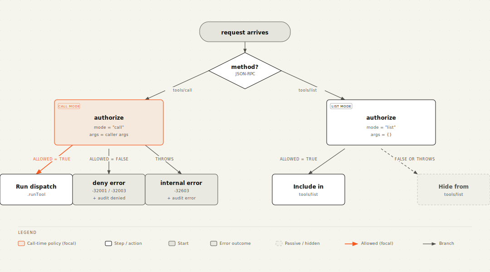

# Authorization

The gateway delegates every access decision to **one JS callback you write**:
the *authorize* function. The component itself has no notion of public
tools, scopes, roles, or tenant boundaries. That keeps the component
generic and lets your auth model be whatever it already is.

## Why a callback, not a registered Convex function

Convex doesn't propagate `ctx.auth` into component code (this is
documented behaviour, not a bug). The JWT-validated identity is only
visible inside the host's own `httpAction` context. So the authorize
callback is a regular async function the host hands to
`gateway.handleMcpRequest`, runs inline in the host's context, and reads
identity via the normal `ctx.auth.getUserIdentity()` API.

Practically this means:

- No `setAuthorizer` mutation, no registered `internalQuery`, no
  `FunctionHandle`. The function is just a closure.
- Database access works exactly like in any host code: `ctx.runQuery`,
  `ctx.runMutation`, `ctx.runAction`.
- You can swap the callback per environment (dev allows everything,
  prod is strict) without redeploying tools.
- Tests run the same callback in-process via convex-test's `t.fetch`.

## The contract

```ts
import {
  type McpAuthorizerHandler,
} from "@tfohlmeister/convex-mcp-gateway";

const authorize: McpAuthorizerHandler = async (ctx, args) => {
  // ... your decision ...
  return { allowed: true };
};
```

Your handler receives:

| Field | Type | Meaning |
|---|---|---|
| `toolName` | `string` | Registered tool name |
| `toolKind` | `"query" \| "mutation" \| "action"` | What kind of function it is |
| `args` | `Record<string, unknown>` | Caller-supplied arguments (`{}` in `mode: "list"`) |
| `mode` | `"call" \| "list"` | See below |
| `toolMetadata` | `unknown` | Whatever the host passed via `defineMcp*({ metadata })` |

Return either `{ allowed: true }` or `{ allowed: false, reason?: string }`.

If `reason` starts with `"Unauth"` (case-insensitive), the gateway maps
the JSON-RPC error to `-32001 Unauthorized` and adds a
`WWW-Authenticate` header on the HTTP 401 response (so MCP clients can
begin the OAuth flow). Anything else maps to `-32003 Forbidden` without
discovery hints.

If your callback **throws**, the gateway treats it as `-32603 Authorizer
threw: ...` and writes an audit row with outcome `error`. Throw only for
"the policy itself is broken" cases (DB unreachable, malformed config);
for "user is not allowed" cases, return `{ allowed: false, reason }`.

## Two modes: `call` and `list`



The contract: **the catalog visible to a caller equals the set of tools
they could actually invoke.** An unauthenticated client never sees the
admin mutation in their tool list. A finance team member never sees the
HR tool, even by name.

Most authorize callbacks ignore `mode` because the same logic determines
both "can I see this" and "can I call this". Use `mode === "list"` only
when you want to expose a tool's existence even though calls might still
be gated on dynamic arguments. Example: a search tool that's listable to
everyone but only callable for authenticated users could check
`if (mode === "list") return { allowed: true }; ...`.

## Recipes

### Public + authenticated tools, identity-only

Simplest possible policy: tools opt in to public via metadata; everything
else needs a valid JWT.

```ts
import { type McpAuthorizerHandler } from "@tfohlmeister/convex-mcp-gateway";

const authorize: McpAuthorizerHandler = async (ctx, { toolMetadata }) => {
  const meta = (toolMetadata ?? {}) as { public?: boolean };
  if (meta.public) return { allowed: true };

  const identity = await ctx.auth.getUserIdentity();
  if (!identity) return { allowed: false, reason: "Unauthorized" };
  return { allowed: true };
};
```

Tool registration:

```ts
defineMcpQuery({
  name: "stats_public",
  description: "Public counters.",
  fn: api.stats.public,
  args: {},
  metadata: { public: true },
}),
defineMcpQuery({
  name: "stats_private",
  description: "Per-user counters.",
  fn: api.stats.private,
  args: {},
}),
```

### Role-based access via JWT claims

Most JWT issuers expose a `roles` (or `groups`) claim. Convex makes
arbitrary identity fields available via cast-through:

```ts
const authorize: McpAuthorizerHandler = async (ctx, { toolMetadata }) => {
  const identity = await ctx.auth.getUserIdentity();
  if (!identity) return { allowed: false, reason: "Unauthorized" };

  const roles =
    ((identity as { roles?: unknown }).roles as string[] | undefined) ?? [];

  const meta = (toolMetadata ?? {}) as { roles?: string[] };
  const requiredRoles = meta.roles ?? [];
  const hasRequired = requiredRoles.every((r) => roles.includes(r));
  if (!hasRequired) {
    return {
      allowed: false,
      reason: `Forbidden: needs roles ${requiredRoles.join(", ")}`,
    };
  }
  return { allowed: true };
};
```

Tool registration:

```ts
defineMcpMutation({
  name: "invoices_markPaid",
  description: "Mark an invoice as paid.",
  fn: api.invoices.markPaid,
  args: { id: v.id("invoices") },
  metadata: { roles: ["finance.admin"] },
}),
```

The `roles` array lives on the *tool*, the matching logic lives in the
authorize callback, and the runtime claim lives on the *identity*. None
of them needs to know about the others' shape.

### Scope-based access (OAuth-style)

Same pattern, different field name. Map the OAuth `scope` claim to a
list and check intersection:

```ts
const authorize: McpAuthorizerHandler = async (ctx, { toolMetadata }) => {
  const identity = await ctx.auth.getUserIdentity();
  if (!identity) return { allowed: false, reason: "Unauthorized" };

  const tokenScopes = ((identity as { scope?: string }).scope ?? "")
    .split(" ")
    .filter(Boolean);

  const meta = (toolMetadata ?? {}) as { scopes?: string[] };
  const required = meta.scopes ?? [];
  const missing = required.filter((s) => !tokenScopes.includes(s));
  if (missing.length > 0) {
    return {
      allowed: false,
      reason: `Forbidden: missing scopes ${missing.join(", ")}`,
    };
  }
  return { allowed: true };
};
```

### Argument-aware policies

The callback sees the actual `args` for `mode: "call"`. So per-record
decisions are straightforward:

```ts
const authorize: McpAuthorizerHandler = async (ctx, { toolName, args, mode }) => {
  // tools/list never knows the args; allow listing here, gate at call time.
  if (mode === "list") {
    const identity = await ctx.auth.getUserIdentity();
    return identity
      ? { allowed: true }
      : { allowed: false, reason: "Unauthorized" };
  }

  const identity = await ctx.auth.getUserIdentity();
  if (!identity) return { allowed: false, reason: "Unauthorized" };

  if (toolName === "invoices_markPaid") {
    const inv = await ctx.runQuery(api.invoices.get, {
      id: args.id as Id<"invoices">,
    });
    if (!inv) return { allowed: false, reason: "Invoice not found" };
    if (inv.ownerId !== identity.subject) {
      return { allowed: false, reason: "Forbidden: not your invoice" };
    }
  }
  return { allowed: true };
};
```

The callback runs inside an `httpAction`, so DB access goes through
`ctx.runQuery` / `ctx.runMutation`. Keep these checks fast; they run on
every call.

### Anonymous-allowed but rate-limited

Combine the gateway's authorize callback with the
[`@convex-dev/rate-limiter`](https://www.npmjs.com/package/@convex-dev/rate-limiter)
component for "public but bounded" tools:

```ts
const authorize: McpAuthorizerHandler = async (ctx, { toolMetadata }) => {
  const meta = (toolMetadata ?? {}) as { public?: boolean; limit?: string };
  if (!meta.public) {
    const identity = await ctx.auth.getUserIdentity();
    if (!identity) return { allowed: false, reason: "Unauthorized" };
    return { allowed: true };
  }

  // Public path: still rate-limit by IP / fingerprint.
  if (meta.limit) {
    const key = await fingerprintFromCtx(ctx); // your function
    const ok = await rateLimiter.check(ctx, { key: `${meta.limit}:${key}` });
    if (!ok.ok) return { allowed: false, reason: "Forbidden: rate limited" };
  }
  return { allowed: true };
};
```

## Audit-redaction via metadata

If a tool's argument schema can carry secrets (API keys, tokens, PII),
opt out of arg storage in the audit log per tool. Three modes (functions
cannot be transmitted to Convex, so all configuration is declarative):

```ts
// 1. Default: store args verbatim. (metadata.auditArgs implicit true)
defineMcpMutation({
  name: "invoices_markPaid",
  fn: api.invoices.markPaid,
  args: { id: v.id("invoices") },
}),

// 2. Drop args entirely.
defineMcpMutation({
  name: "secrets_import",
  fn: api.secrets.import,
  args: { blob: v.string() },
  metadata: { auditArgs: false },
}),

// 3. Field-level redaction. Dotted paths walk nested objects:
//    "credentials.token" replaces the inner `token` leaving the
//    rest of `credentials` intact. Missing intermediate keys and
//    arrays are passed through unchanged.
defineMcpMutation({
  name: "users_create",
  fn: api.users.create,
  args: { email: v.string(), password: v.string(), name: v.string() },
  metadata: { auditArgs: { redact: ["password"] } },
}),
```

The audit row still records who, when, outcome, and duration; only `args`
is affected. See [audit-log.md](./audit-log.md) for the full audit schema.

## Common pitfalls

- **Forgetting to pass `authorize`.** `gateway.handleMcpRequest(ctx,
  request, { authorize })` is the only public entry point. Without the
  options object you'll get a TypeScript error at compile time.
- **Throwing for "user error" cases.** The gateway treats authorize
  throws as `-32603 Authorizer threw: ...` (audit outcome `error`)
  because that signals "the policy itself is broken, retry won't help".
  For "user not allowed", return `{ allowed: false, reason }` instead.
- **Mode-sensitive logic that breaks tools/list.** If you write
  `if (mode === "list") return { allowed: false }` you'll hide all your
  tools from clients. Default visibility should match callability.
- **Reading `args` in `mode: "list"`.** It is always `{}`. Decisions
  that depend on the actual call payload must allow list-mode and
  re-check at call-mode.
- **Trying to read `ctx.auth` inside a tool function called from the
  component.** Convex strips auth context across the component boundary.
  If a tool needs the caller's identity, pass it as an argument from the
  authorize callback or the host (the `auditIdentitySubject` plumbing
  inside the gateway is for the audit log only).
