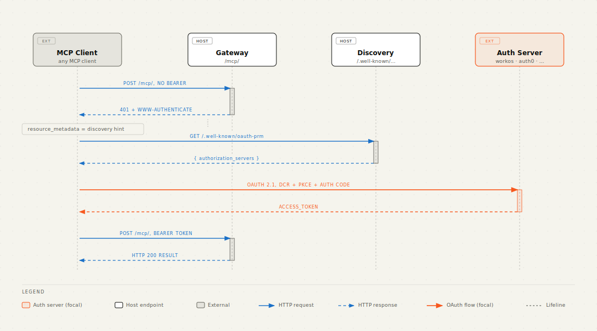
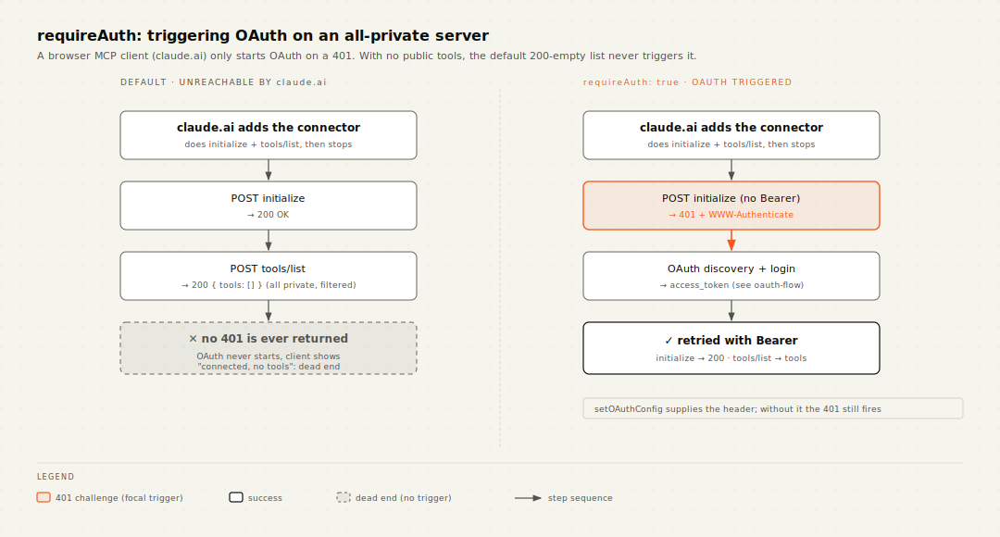

# OAuth 2.1 setup

The gateway implements the **resource server** half of MCP's OAuth
profile: it advertises the right discovery metadata so MCP clients can
find your authorization server, and it returns RFC 6750 `WWW-Authenticate`
headers on 401s so the client knows where to look.

It does **not** ship its own authorization server. You bring whatever
issuer you already use (Pocket-ID, Auth0, Clerk, Keycloak, AWS Cognito,
Google, custom) and Convex validates inbound Bearer tokens against it
via `auth.config.ts` like for any other Convex deployment.

## The flow



The client never has to know your AS URL up-front. It learns it from the
`WWW-Authenticate` header on the first 401 and follows the discovery
chain from there.

## Configuration (host side)

Two things are required: tell the gateway about your AS, and mount the
discovery handler at the canonical RFC 9728 path.

### 1. Set the OAuth config

```ts
// convex/mcp.ts (in your bootstrap mutation)
await gateway.setOAuthConfig(ctx, {
  authServerUrl: "https://idp.example.com/",
});
```

The URL is validated as `http://` or `https://` at write time; an
invalid value throws `ConvexError` immediately rather than crashing the
401 path later.

`resourceUrl` is optional. Leave it unset and the gateway derives the
canonical resource URL from inbound request URLs. Set it explicitly for
multi-tenant deployments behind a custom domain, or any scenario where
the user-facing URL differs from what Convex sees:

```ts
await gateway.setOAuthConfig(ctx, {
  authServerUrl: "https://idp.example.com/",
  resourceUrl: "https://api.your-customer.com/mcp/",
});
```

### 2. Mount the discovery handler

The host owns every gateway-related route, including discovery. RFC 9728
§3.1 mandates the metadata at
`<origin>/.well-known/oauth-protected-resource<path>`, so the host adds
it next to the `/mcp/` route already mounted in
[Getting Started step 4](./getting-started.md#4-mount-mcp-with-your-authorize-callback):

```ts
// convex/http.ts (extending the router from getting-started.md step 4)
import { httpRouter } from "convex/server";
import { McpGateway } from "convex-mcp-gateway";
import { components } from "./_generated/api.js";
import { httpAction } from "./_generated/server.js";

const gateway = new McpGateway(components.mcpGateway);
const http = httpRouter();

// /mcp/ routes from getting-started step 4 here ...

// Exact-path route: serves the canonical metadata for the /mcp resource.
http.route({
  path: "/.well-known/oauth-protected-resource/mcp",
  method: "GET",
  handler: httpAction(async (ctx, request) =>
    gateway.serveProtectedResourceMetadata(ctx, request),
  ),
});

// (Optional) Catch-all for sub-resources, e.g. /mcp/tenants/<id>/.
// Convex's pathPrefix routes require a trailing slash.
http.route({
  pathPrefix: "/.well-known/oauth-protected-resource/",
  method: "GET",
  handler: httpAction(async (ctx, request) =>
    gateway.serveProtectedResourceMetadata(ctx, request),
  ),
});

export default http;
```

`serveProtectedResourceMetadata` reads the OAuth config you set in
step 1, derives the resource URL from the request (or uses your
explicit `resourceUrl`), and returns:

```json
{
  "resource": "https://app.example.com/mcp/",
  "authorization_servers": ["https://idp.example.com/"],
  "bearer_methods_supported": ["header"]
}
```

When no OAuth config is set, the handler returns 404, and the gateway
also stops adding `WWW-Authenticate` headers on 401s. Discovery is
opt-in.

## What the 401 looks like

Once OAuth is configured, an unauthorized `tools/call` returns:

```http
HTTP/1.1 401 Unauthorized
content-type: application/json
www-authenticate: Bearer resource_metadata="https://app.example.com/.well-known/oauth-protected-resource/mcp"

{"jsonrpc":"2.0","id":3,"error":{"code":-32001,"message":"Unauthorized"}}
```

The `WWW-Authenticate` value follows RFC 6750 (`Bearer` scheme +
`resource_metadata` parameter from MCP 2025-06-18). The `resource_metadata`
URL is the RFC 9728 path-prefix variant that the host mounted in step 2.

Without OAuth config, the same situation returns the JSON-RPC error
inside an HTTP 200 envelope, no header. MCP clients that depend on
discovery will not recover; clients that already have a token can still
call the gateway.

## All-private servers and browser clients (`requireAuth`)



The 401-on-`tools/call` trigger above is enough for a **mixed** server
(some tools `public`, some private): an anonymous caller sees the public
catalog, picks a private tool, gets the 401, and OAuth begins.

It is **not** enough for an **all-private** server reached by a browser
MCP client like **claude.ai**. When a connector is added, claude.ai only
does `initialize` + `tools/list`, it does not call a tool unprompted.
With the default behaviour both return HTTP 200 (`tools/list` is the
authorize-filtered, here empty, list), so claude.ai concludes
"connected, no tools" and **never** starts the OAuth flow, its only
trigger is a `401` + `WWW-Authenticate`. The user is never asked to log
in.

Opt into challenging anonymous requests at the door with `requireAuth`:

```ts
// convex/http.ts
const mcpHandler = httpAction(async (ctx, request) =>
  gateway.handleMcpRequest(ctx, request, {
    authorize,
    cors: true,
    requireAuth: true, // all-private + browser client → challenge anonymous POSTs
  }),
);
```

With `requireAuth: true`, any anonymous POST (including `initialize` and
`tools/list`) is answered with `401` + `WWW-Authenticate` instead of
being let through, so the browser client gets the trigger it needs.
claude.ai then re-runs `initialize` with the Bearer after login.

Notes:

- **Opt-in.** The default (200 with the filtered catalog) is unchanged
  and stays correct for mixed servers, anonymous callers should still
  see the public tools.
- **Needs `setOAuthConfig`.** The `WWW-Authenticate` header carries the
  protected-resource metadata URL, which only exists once OAuth config
  is set. If `requireAuth` is on but no config exists, the gate still
  returns 401 but without the header (and logs a one-time warning);
  browser clients can't begin discovery until you call `setOAuthConfig`.
- **POST only.** `GET` already 405s, `DELETE` is identity-bound, and the
  CORS preflight (`OPTIONS`) is left untouched.

## Validating the inbound token

Token validation is **Convex's job**, not the gateway's. Set your
`auth.config.ts` to the matching issuer:

```ts
// convex/auth.config.ts
export default {
  providers: [
    {
      domain: "https://idp.example.com/",
      applicationID: "your-mcp-client-id",
    },
  ],
};
```

Convex fetches the JWKS from the issuer's `/.well-known/jwks.json` and
validates the `Authorization: Bearer <jwt>` header on every inbound
request. If validation passes, `ctx.auth.getUserIdentity()` (called
inside the host's `/mcp/` `httpAction`) returns the JWT claims (subject,
scopes, roles, etc.). If validation fails, the identity is `null` and
the authorize callback rejects the call.

## Multi-tenant deployments

For per-tenant isolation, mount one `/mcp/` route per tenant prefix
(e.g. `/mcp/tenants/acme/`, `/mcp/tenants/beta/`) in the host's `http.ts`
(each route invokes the same `handleMcpRequest` with a tenant-aware
authorize callback), and set `resourceUrl` explicitly per tenant so the
discovery metadata reports the right resource identifier:

```ts
await gateway.setOAuthConfig(ctx, {
  authServerUrl: "https://idp.example.com/",
  resourceUrl: "https://api.example.com/mcp/tenants/acme/",
});
```

Combined with RFC 8707 audience binding on the AS side, this gives you
hard token-level isolation: an `acme` token is rejected by the `beta`
resource server even if both share an AS.

## Testing locally

The repo's `pnpm local:start` writes a `.env.local` against the upstream
Convex test fixtures, so the deployment URL is `http://127.0.0.1:3311`.
With OAuth config set to a placeholder issuer, you can hit:

```sh
curl -i -X POST http://127.0.0.1:3311/mcp/ \
  -H 'content-type: application/json' \
  -H 'accept: application/json, text/event-stream' \
  -d '{"jsonrpc":"2.0","id":1,"method":"tools/call","params":{"name":"private.tool","arguments":{}}}'
```

and see the `WWW-Authenticate` header pointing at
`http://127.0.0.1:3311/.well-known/oauth-protected-resource/mcp`. Then:

```sh
curl http://127.0.0.1:3311/.well-known/oauth-protected-resource/mcp | jq
```

returns the metadata JSON. End-to-end testing with a real MCP client
requires a real issuer the client trusts; local-only OAuth requires
either a local AS or a tunneled deployment so the IdP can reach the
callback URL.

## What's not yet covered

The gateway today implements **resource-server** discovery only.
There is no plan to ship a bundled authorization server: building DCR
+ PKCE + token issuance + key rotation reproduces what every modern
IdP already does, and folding an AS into the same component would be
two security-critical surfaces sharing a release cycle. The official
position is **bring your own IdP**, and the resource-server side
plays nice with anything OAuth 2.1 / OIDC.

If your IdP doesn't support Dynamic Client Registration (RFC 7591)
and an MCP client demands it, register a single shared client at the
IdP and configure each MCP client to use that fixed client id. Most
spec-compliant clients (the official MCP Inspector, IDE plugins,
agent runtimes) support pre-registered clients.
